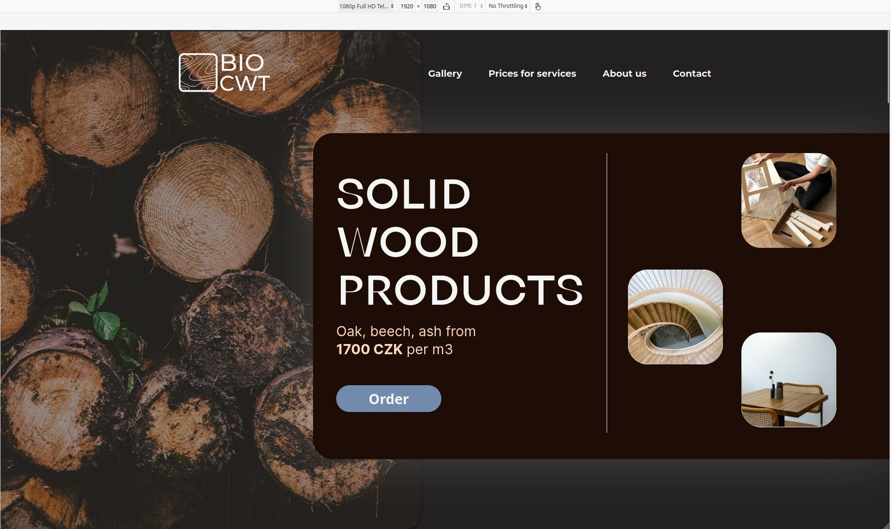
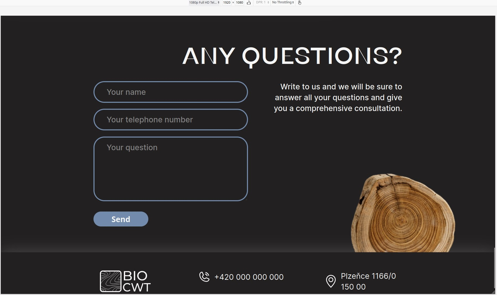
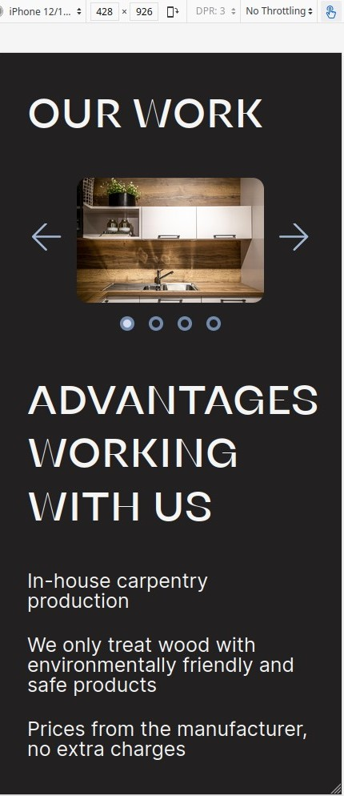
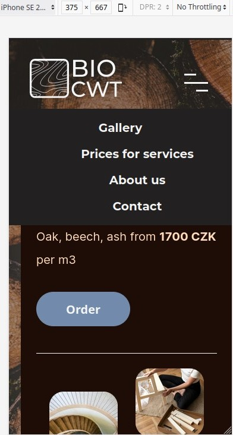

# Wood Product Services

Wood Product Services is a project created from mockup. Using Figma for detailed study and use of the layout. The following technologies were used in the project: HTML, CSS, JavaScript, Google Fonts, jQuery, slick library for create sliders on the site and Magnific Popup is a responsive jQuery lightbox plugin used for lazy-loading of gallery images. 

This work is based on **[wood product services website](https://www.figma.com/community/file/1136307990435971516)**
by *[GLOS Dashka](https://www.figma.com/@glosdashka)* 
licenced under [CC BY 4.0](https://creativecommons.org/licenses/by/4.0/)

### Website looks like this on 1080 Full HD

### Website looks like this on iPad

### Site view on iPhone12 Pro

### Website looks like this on iPhoneSE

